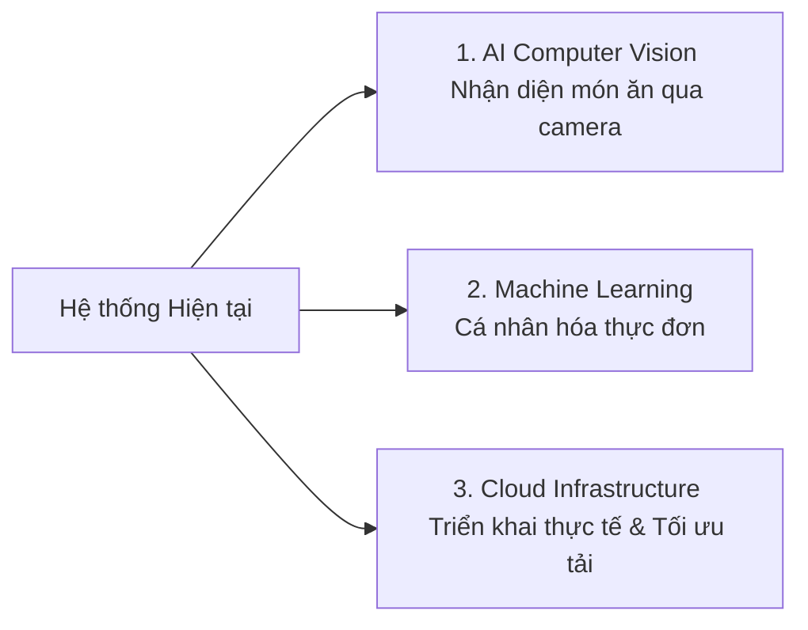

# CHƯƠNG 5: KẾT LUẬN

Sau quá trình nghiên cứu, thiết kế và phát triển thực nghiệm, đề tài đã hoàn thành việc xây dựng và kiểm thử thành công hệ thống quản lý chế độ dinh dưỡng cá nhân hóa (Nutrition App). Dưới đây là các kết luận tổng kết toàn diện của đề tài:

---

## 5.1 Các kết quả đạt được (Key Deliverables)

Hệ thống đã hiện thực hóa thành công mô hình kiến trúc đa nền tảng hoàn chỉnh, đáp ứng đầy đủ các yêu cầu nghiệp vụ thực tiễn:

### 1. Ứng dụng Di động Người dùng (React Native Mobile Client)
* **Kết luận**: Đề tài đã xây dựng thành công giao diện di động trực quan, hiện đại và thân thiện với người dùng.
* **Tính năng**: 
  * Tích hợp thành công đăng ký, đăng nhập bảo mật và quản lý hồ sơ thể trạng người dùng.
  * Tự động tính toán chỉ số khối cơ thể **BMI** động kèm theo đề xuất calo mục tiêu.
  * Hỗ trợ ghi nhật ký ăn uống chính xác theo đơn vị gram và biểu diễn trực quan biểu đồ năng lượng hấp thụ hàng ngày.

### 2. Dashboard Quản trị (Admin Dashboard Portal)
* **Kết luận**: Hoàn thiện cổng quản trị trực quan dành cho người vận hành hệ thống.
* **Tính năng**:
  * Giám sát toàn bộ dữ liệu người dùng và tùy chỉnh thay đổi trạng thái tài khoản (Lock/Unlock) bảo mật.
  * Theo dõi hệ thống thông qua nhật ký kiểm toán (**Audit Logs**) chi tiết về địa chỉ IP khách, hành động thực tế và thời gian thực hiện.

### 3. Lõi Nghiệp vụ Backend & Cơ sở Dữ liệu (Spring Boot 3 & PostgreSQL Layer)
* **Kết luận**: Thiết lập thành công lõi nghiệp vụ an toàn và chính xác tuyệt đối.
* **Tính năng**:
  * Hiện thực hóa giải thuật Mifflin-St Jeor tính toán năng lượng TDEE và cơ chế bù trừ calo thích ứng động sang ngày hôm sau được giới hạn an toàn trong biên sinh lý học `[1200 kcal - 5000 kcal]`.
  * Xây dựng bộ khung kiểm thử tự động khép kín gồm **71 kịch bản kiểm thử** chạy thành công 100%, bảo chứng cho độ tin cậy của dịch vụ.

---

## 5.2 Hạn chế hiện tại (Current Limitations)

Mặc dù giao diện ứng dụng và các chức năng lõi của hệ thống đã hoạt động ổn định và chính xác dưới sự bảo vệ của hệ thống kiểm thử tự động, đề tài hiện vẫn có một số mặt hạn chế nhất định:
* Hệ thống chủ yếu tập trung hoàn thiện ở giai đoạn phát triển giao diện trực quan và xử lý nghiệp vụ lõi (Core Business Logic).
* Chưa tích hợp sâu và hoàn thiện toàn bộ phần xử lý nghiệp vụ thông minh cũng như ứng dụng các mô hình Trí tuệ Nhân tạo (AI) nâng cao để tối ưu hóa tối đa tương tác người dùng.

---

## 5.3 Hướng phát triển trong tương lai (Future Directions)

Nhằm nâng cao tính ứng dụng thực tiễn và khả năng mở rộng của hệ thống, đề tài vạch ra những định hướng phát triển rõ nét cho các phiên bản tiếp theo:

### 1. Tích hợp Nhận diện Món ăn bằng AI (AI Computer Vision)
* **Định hướng**: Tích hợp mô hình thị giác máy tính nhận diện thực phẩm trực tiếp thông qua camera điện thoại để tự động ước lượng khối lượng và phân tích chỉ số dinh dưỡng.

### 2. Cá nhân hóa Thực đơn Dinh dưỡng (Machine Learning Personalization)
* **Định hướng**: Ứng dụng các thuật toán học máy phân tích dữ liệu lịch sử thói quen để tự động gợi ý thực đơn, công thức nấu ăn thông minh phù hợp nhất với thể trạng của mỗi người dùng.

### 3. Tối ưu Hiệu năng & Triển khai Thực tế (Production Deployment & Scaling)
* **Định hướng**: Triển khai phân tán hệ thống trên môi trường đám mây sử dụng Docker & Kubernetes, đồng thời tối ưu hóa bộ nhớ đệm phân tán Redis để đảm bảo hệ thống vận hành trơn tru dưới tải lượng truy cập lớn.
