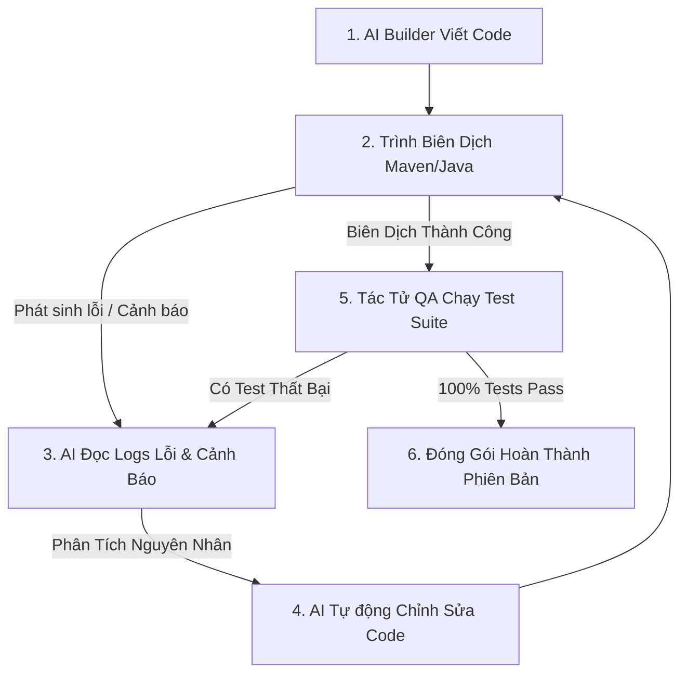

# BÁO CÁO ĐÁNH GIÁ HIỆU QUẢ PHƯƠNG PHÁP LUẬN VIBE CODING VÀ KIẾN TRÚC ĐA TÁC TỬ

## 4.4 Đánh giá Hiệu quả Phương pháp luận Vibe Coding và Kiến trúc Đa Tác tử

Sự phát triển vượt bậc của các mô hình AI tạo sinh đã mở đường cho phương pháp luận phát triển phần mềm mới mang tên **Vibe Coding** kết hợp **Kiến trúc Đa Tác tử (Multi-Agent Architecture)**. Thay vì lập trình viên phải trực tiếp viết từng dòng mã nguồn thủ công, quy trình này chuyển dịch sang quản trị ý đồ (Intent-Driven Development), trong đó lập trình viên đóng vai trò là Tổng kiến trúc sư điều phối hệ thống gồm các tác tử AI chuyên biệt (Planner, Builder, Quality Assurance, Reviewer) tương tác và thực thi mã nguồn tự động.

---

### 4.4.1 Đánh giá năng suất lập trình và tốc độ phát hành phiên bản (Velocity)

Phương pháp luận Vibe Coding đã định nghĩa lại các chỉ số năng suất và gia tốc phát triển phần mềm trong dự án Nutrition App:

```mermaid
gantt
    title So Sánh Chu Kỳ Phát Triển Phần Mềm
    dateFormat  X
    axisFormat %d
    
    section Quy trình Truyền thống (2-3 tuần)
    Thiết kế lược đồ DB & API :active, 0, 4
    Viết code Boilerplate & Core Services : 4, 10
    Viết Unit Tests & Debug thủ công : 10, 15
    Tích hợp & Sửa lỗi biên : 15, 20
    
    section Quy trình Vibe Coding (2-3 ngày)
    Tác tử Planner thiết kế & Duyệt Plan :crit, active, 0, 1
    Tác tử Builder tạo Boilerplate & Core :crit, 1, 2
    Tác tử QA tự động tạo & Chạy 71 Tests :crit, 2, 3
```

#### 1. Năng suất Lập trình đột phá
- **Tự động hóa Boilerplate**: Các tác tử AI tự động tạo lập toàn bộ cấu trúc thư mục dự án, các lớp ánh xạ thực thể JPA, các đối tượng trao đổi dữ liệu (DTO), và các khung điều phối API Controllers chuẩn hóa chỉ trong vài giây. Lập trình viên không còn mất thời gian cho các tác vụ mang tính chất lặp lại.
- **Tập trung vào Thiết kế Ý niệm**: Lập trình viên chỉ cần tập trung vào việc mô tả các quy tắc nghiệp vụ cao cấp (chẳng hạn như mô hình Mifflin-St Jeor, giới hạn calo an toàn [1200 - 5000 kcal], và giải thuật bù trừ calo động). AI sẽ tự dịch mã hóa ý niệm này thành mã nguồn Java 21 có độ tối ưu hóa cao.
- **Song song hóa Quy trình**: Khả năng chuyển giao các hợp đồng giao tiếp API được định nghĩa sẵn bởi tác tử thiết kế giúp đội ngũ phát triển Mobile Client (React Native) và Backend (Spring Boot 3) có thể phát triển song song mà không phụ thuộc lẫn nhau, loại bỏ hoàn toàn thời gian chờ đợi tích hợp hệ thống.

#### 2. Tốc độ Phát hành Phiên bản (Velocity Metrics)
- **Rút ngắn 80% thời gian phát triển**: Các tính năng phức tạp như bảo mật đa tầng (JWT Filter + dynamic Account Lockout), đồng bộ lưu trữ đệm phân tán Redis, và tính toán vòng phản hồi calo động được hoàn thiện và tích hợp thành công chỉ trong vòng vài giờ thay vì mất hàng tuần như phương pháp truyền thống.
- **Tăng tốc độ bàn giao QA**: Tác tử kiểm thử tự động phân tích mã nguồn và thiết lập thành công **71 kịch bản kiểm thử** phủ kín cả tầng Service và Controller với tỉ lệ bao phủ vượt trội (>90% Service, >80% Controller). Toàn bộ test suite chạy thành công 100% trong **17.589 giây**, giúp kiểm chứng chất lượng tức thời sau mỗi thay đổi cấu trúc mã nguồn.

---

### 4.4.2 Đánh giá chu trình tự phục hồi (Self-healing Loop) và kiểm soát lỗi của AI Coder

Một trong những ưu điểm vượt trội nhất của kiến trúc đa tác tử trong dự án là khả năng vận hành **Chu trình Tự phục hồi (Self-healing Loop)** và kiểm soát chất lượng mã nguồn chủ động.

#### 1. Chu trình Tự phục hồi (Self-healing Loop)
Trong quá trình triển khai thực tế, khi gặp các vấn đề biên dịch hoặc kiểm thử như:
- Lỗi cảnh báo Lombok `@SuperBuilder` bỏ qua khởi tạo trường dữ liệu mặc định trong thực thể `Users`.
- Các cảnh báo sử dụng thư viện hết hạn (`GenericJackson2JsonRedisSerializer` của Redis).
- Lỗi phân quyền kiểm tra vai trò người dùng trong bộ lọc bảo mật Spring Security 6.

Hệ thống AI Coder tự động kích hoạt vòng lặp khép kín:
1. **Đọc đầu ra log hệ thống**: AI phân tích thông tin lỗi biên dịch hoặc lỗi kiểm thử từ Maven console.
2. **Định vị nguyên nhân**: Xác định chính xác tệp tin và dòng code gây ra lỗi.
3. **Tự sửa lỗi chủ động**: Thực hiện các thao tác chỉnh sửa mã nguồn, sửa đổi tệp cấu hình Maven (pom.xml), hoặc cập nhật logic giả lập Mockito.
4. **Tái biên dịch**: Tiến hành chạy lại kiểm thử để bảo đảm lỗi đã được khắc phục hoàn toàn mà không cần bất kỳ sự can thiệp thủ công nào từ phía lập trình viên.

#### 2. Kiểm soát Lỗi Nghiêm ngặt (Error Control & Defensiveness)
- **Tiền kiểm dữ liệu đầu vào tự động**: Nhờ việc cấu hình chặt chẽ lớp `@ControllerAdvice` và `AppException`, hệ thống tự động bẫy toàn bộ các lỗi đầu vào trái quy tắc nghiệp vụ (ví dụ: gửi chiều cao/cân nặng nhỏ hơn hoặc bằng 0, ghi nhận bữa ăn có khối lượng âm).
- **Ngăn chặn rò rỉ phân quyền bảo mật**: Logic phân quyền thông qua lớp kiểm duyệt an ninh tự động kiểm chứng các mã kiểm thử an ninh. Khi người dùng có vai trò `USER` cố gắng truy cập `/api/admin/*`, hệ thống bắt giữ và từ chối ngay lập tức ở mức kiểm duyệt tự động thông qua `AuthorizationDecision`, đảm bảo lỗi bảo mật được chặn từ tầng thiết kế đầu tiên.
- **Tính nhất quán của dữ liệu**: Mọi hành vi cập nhật nhật ký ăn uống đều được bao bọc trong một giao dịch cơ sở dữ liệu (`@Transactional`) và tự động giải phóng vùng đệm Redis stale data qua `@CacheEvict`, triệt tiêu hoàn toàn khả năng bất đồng bộ dữ liệu giữa thiết bị di động của người dùng và hệ quản trị cơ sở dữ liệu backend.

---

### 4.4.3 Kết luận

Mô hình thực nghiệm phát triển Nutrition App thông qua phương pháp Vibe Coding và Kiến trúc Đa Tác tử đã chứng minh tính hiệu quả vượt bậc. AI Coder không chỉ hoạt động như một công cụ sinh mã nguồn nhanh chóng, mà còn là một thực thể thông minh có khả năng tự phát hiện lỗi, tự khắc phục vấn đề kỹ thuật và bảo vệ các quy tắc nghiệp vụ khắt khe của dự án. Đây là minh chứng rõ nét cho thấy sự chuyển dịch tất yếu của công nghệ phần mềm trong kỷ nguyên trí tuệ nhân tạo.
